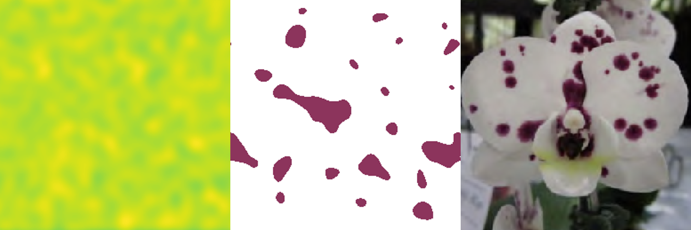
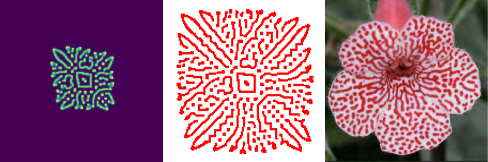
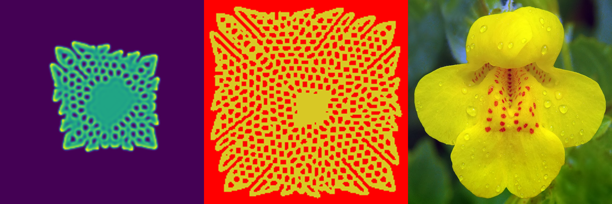

# Genetic Algorithms for the Physical Simulation of Flower Pigmentation Patterns

An undergraduate thesis by _Grant Skaggs_ for the Turing Scholars honors distinction.

## Background

Why simulate flower pigmentation patterns in the first place? And why use genetic algorithms during this process? Good questions. I'm glad you asked.

There is an alternative to physical modeling we might consider for synthesizing images of flowers: texture mapping. This technique involves first manufacturing a "texture" of the flower, either by taking a high-resolution photograph or having an artist paint it. Then, the texture is projected onto the geometry of a flower, and _boom_ you have a pretty picture of a flower. Yep, just like that.

As nice as that sounds, there are some potential disadvantages of texture mapping.

1. Distortion: If you don't carefully project the texture onto the flower geometry, you'll get undesireable artifacts. This makes using different flower geometries with the same texture difficult.
1. Scalability: Though some methods exist for this purpose, it's very often difficult to generate many copies of a texture with small modifications. So, for example, to make a patch of flowers which don't all look identical is hard.
1. Biological insight: Texture mapping offers no insight into the fundamental biology of flowers.

Physical simulation, on the other hand, does not suffer from any of these disadvantages. You don't get distortions when you use different geometries. You can (usually) easily modify parameters of the simulation to create many unique individuals. You will often get biological instight into the systems you are simulating.

Now you're thinking, _Okay, Grant, you've sold me. But what about the genetic algorithms?_

Fair enough. The genetic algorithms come into play because simulating flowers can be really difficult. The state of the art in this space is a paper called "Modeling Flower Pigmentation Patterns" by Ringham et al. They got very impressive results, but at the end of the day... Well that's just the problem, modeling these flowers takes _all day._ \

It turns out that for flowers with complicated patterns, the best way to simulate them is using a class of partial differential equations called _reaction-diffusion equations._ This is all well and good but finding the right parameters for these equations is very difficult. So much so that the process of physically simulating these flowers can take days.

In order to better search the space of these reaction-diffusion equations, I've explored in this thesis the use of genetic algorithms.

## Methods

I applied genetic algorithms to three different reaction-diffusion models:

1. [Gray-Scott](https://itp.uni-frankfurt.de/~gros/StudentProjects/Projects_2020/projekt_schulz_kaefer/)
1. [Gierer-Meinhardt](http://www.scholarpedia.org/article/Gierer-Meinhardt_model)
1. GenRD: A generalized model of my own design.

Each individual of a population has one gene for each parameter of these models. And each population is subject to one of two fitness functions:

1. User input
1. Modified Dirichlet energy

(This second function is just the Dirichlet energy, but after normalizing the gradients.)

The selection method used was [fitness proportional selection.](https://en.wikipedia.org/wiki/Fitness_proportionate_selection)

## Results

Check out the three case studies I did:

#### Phalaenoris Nanking’s 4.55

#### Kohleria

#### Mimulus guttatus

## Try It Out!

[You can find the demo online here.](https://reaction-diffusion.herokuapp.com/)
